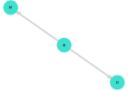

# Dagitty.jl

This project started as rewrite of [Dagitty R package](http://www.dagitty.net/) on Julia language.
The main motivation was porting of "Statistical Rethinking" book examples to Julia, which
could be found on this website: [shmuma.github.io/rethinking-2ed-julia](https://shmuma.github.io/rethinking-2ed-julia/).
So, methods from Dagitty R package are being ported on "as needed" basis.

At the moment, package provides the following functionality:

* [Declaration of DAGs as set of labelled nodes and edges](DAG.md)
* [Drawing of those DAGs using GraphPlot package](utils.md)
* [Check for D-separation between two sets of nodes conditioned on third set of nodes](d_separation.md)
* Discovery of pairwise conditional independent variables.
* [Adjustment sets detection](adj_sets.md)


# Basic examples

```julia
julia> g = DAG(:A => :D, :A => :M)
DAG: {3, 2} directed simple Int64 graph with labels [:A, :D, :M])

# Draw DAG
julia> drawdag(g)
```


```julia
julia> implied_conditional_independencies(g)
1-element Vector{ConditionalIndependence}:
 ConditionalIndependence(:D, :M, [:A])
```
